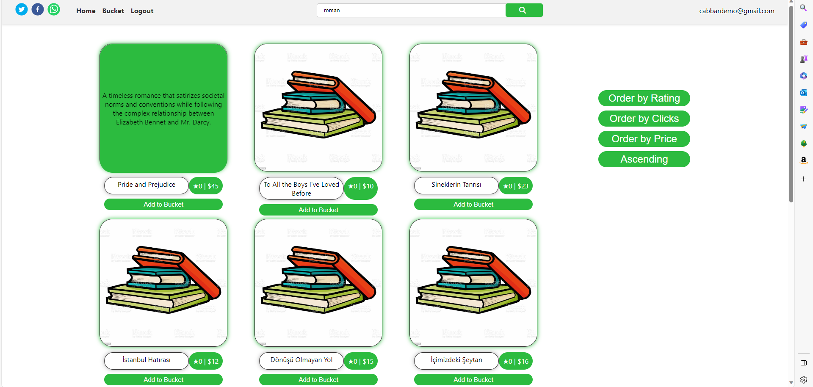
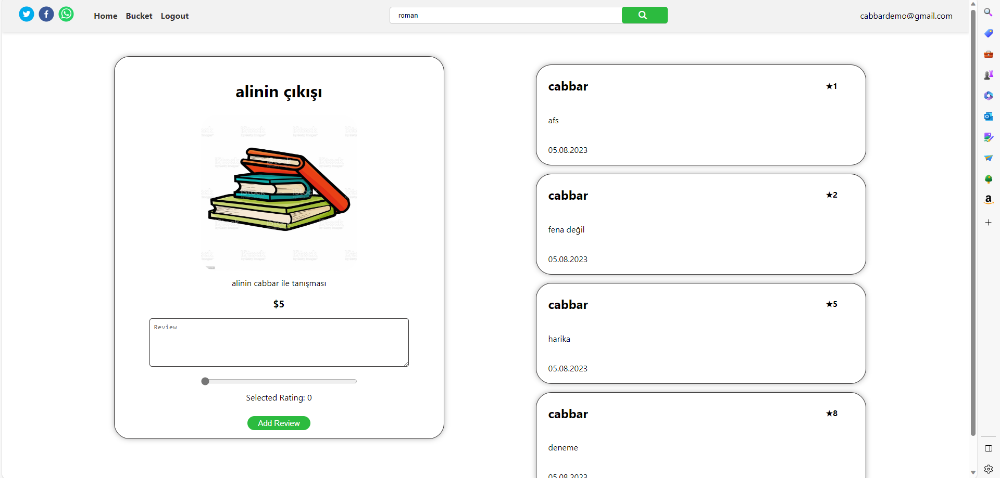

# Book Store: Full-Stack Development

A **web** project prepared for a book store to manage their online sales using full-stack development principles.

## Problem Definition

Growing demand for online book shopping in today's digital era, which arises due to accessibility challenges of traditional bookstores, time constraints, and the desire for a streamlined digital platform.

## Proposed Solution

Development of an efficient online book sales platform where users can seamlessly explore a diverse range of books, leave detailed reviews, provide feedback, and effortlessly purchase desired books. Simultaneously, it offers authors and sellers the means to reach a broader audience by showcasing their literary works.

## Used Technologies

- React
- NodeJS
- JavaScript
- MySQL
- Express
- JSONwebtoken
- Bcrypt

## Implementation

During the implementation of the online book sales platform, React was used for the user interface, while the backend relied on Node.js and Express, with MySQL handling database management. Security measures included JSONwebtoken for user authentication and Bcrypt for data protection. The frontend was designed to ensure a responsive and user-friendly experience, enabling book catalog browsing, and reviews. The backend featured RESTful APIs, user authentication, and endpoints for authors and sellers to manage their literary works. The database schema was meticulously structured to efficiently store user profiles, books, and reviews. This approach resulted in the creation of a secure, efficient, and user-friendly platform connecting book enthusiasts with a diverse range of books while offering authors and sellers a broader audience for their work.

## Results

The implementation of the online book sales platform, developed with a focus on user-friendly design and robust security, delivered excellent results. The platform seamlessly allows users to browse a diverse book catalog, leave detailed reviews, and make effortless purchases. Authors and sellers also benefit from an expanded audience to showcase their literary works. The system employs a combination of front-end and back-end technologies to provide a secure and efficient experience. The database structure was carefully designed to efficiently manage user profiles, books, and reviews, contributing to the overall success of the platform in meeting the demand for convenient online book shopping and providing authors and sellers with a broader reach for their work.
